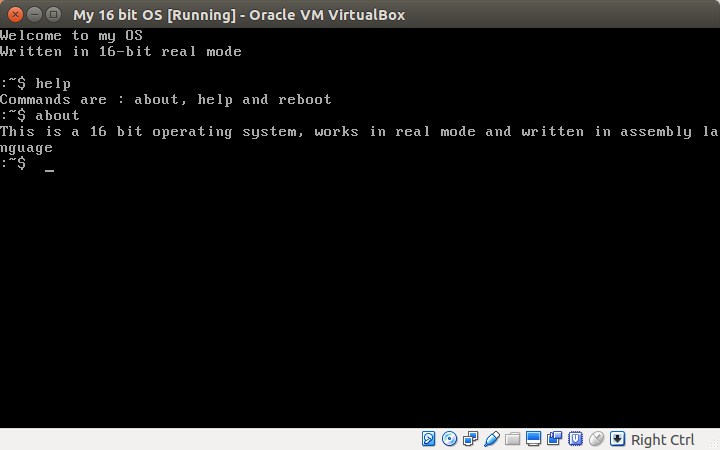

#My 16 bit kernel

This is a project for fun, I made this little 16 bit operating system 
in my free time. I hope you enjoy it!

<p align="center">
 
</p>

##Dependencies

* GNU Make
* NASM 
* QEMU
* genisoimage (It's available in Debian/Ubunti repositories, but if it's not 
available as `genisoimage`, try `cdrtools` or `mkisofs`. )

##How to build 

First, make sure you installed dependencies, and so, run these commands:

```
	make 
```

The command `make` will make a binary from the assembly code, and we'll be 
prepared for making IMG and ISO imaged. 

``` 
	make img
```

Makes an IMG image from binary, and the image can be used as a floppy image
directly. 

```
	make iso
```

This option, will create a directory called `cdiso` and puts `my16bitkernel.img`
in the directory, then it'll make ISO image.

```
	make qemu
```

This option, will boot kernel using QEMU.

```
	make clean
```

This option will remove bin, img and iso files (and of course, cdiso directory!)


